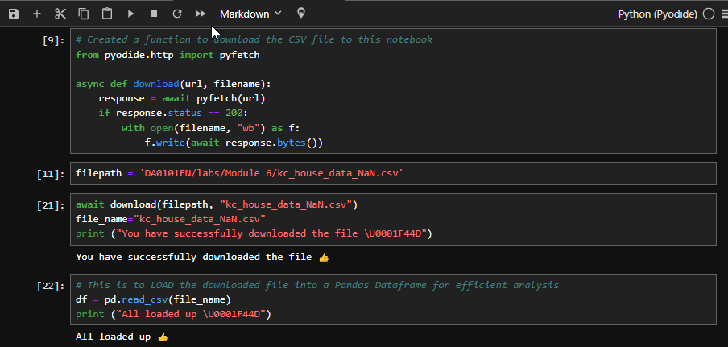

# Analyzing Housing Data for Insights and Predictive Modeling

## Introduction
This project showcases my skills in analyzing housing data and developing predictive models to estimate house prices in King County, Washington DC. I utilized **Jupyter Notebooks**, **Python**, **Scikit-Learn**, and various other tools and libraries.

## Problem Statement
- What is the numerical distribution of houses in King County based on the number of floors?
- Which house features significantly impact pricing?
- Can we create a predictive model for house prices based on selected features for new builds or renovations?

## Skills and Concepts Demonstrated
- Python Analytics
- Statistics
- Regression Analysis
- Predictive Modeling

---

## Data Sourcing and Description

### Data Sourcing

The data was sourced from Kaggle's **"House Sales in King County"** dataset (kc_house_data.csv), which can be found at [this link](https://www.kaggle.com/datasets/harlfoxem/housesalesprediction). Using Python in a Jupyter Notebook, the CSV file was downloaded and loaded into a Pandas DataFrame for effective analysis.

---

### Data Description
The dataset contains real-world house sale data from **May 2014 to May 2015** in King County, including some from Seattle. Initially, the dataset had **21 columns**, but after transformations, it was reduced to **19 columns** and **21,613 rows**, representing unique residential properties.

Below is a summary of the dataset variables:

| Variable           | Description                                                                                   |
|--------------------|-----------------------------------------------------------------------------------------------|
| Id                 | Unique identifier for each house                                                             |
| date               | Date the house was sold                                                                      |
| price              | Sale price of the house                                                                      |
| bedrooms           | Number of bedrooms                                                                           |
| bathrooms          | Number of bathrooms                                                                          |
| sqft_living        | Square footage of interior living space                                                      |
| sqft_lot           | Square footage of the lot                                                                    |
| floors             | Total number of floors in the house                                                          |
| waterfront         | Indicates whether the house has a waterfront view                                            |
| view               | Rating of the house's view                                                                   |
| condition          | Overall condition of the house                                                              |
| grade              | House quality based on King County’s grading system                                          |
| sqft_above         | Square footage excluding basement                                                            |
| sqft_basement      | Square footage of the basement                                                               |
| yr_built           | Year the house was built                                                                     |
| yr_renovated       | Year the house was renovated (if applicable)                                                 |
| zipcode            | ZIP code of the property                                                                     |
| lat                | Latitude coordinate                                                                          |
| long               | Longitude coordinate                                                                         |
| sqft_living15      | Living space in 2015 (post-renovations)                                                      |
| sqft_lot15         | Lot size in 2015 (post-renovations)                                                          |

---

## Methodology

The analysis was performed using the following tools:
- **Pandas**: For data manipulation and analysis.
- **Matplotlib** and **Seaborn**: For creating visualizations such as regression and distribution plots.
- **NumPy**: For numerical computations.
- **Scikit-Learn**: For machine learning tasks, including regression and predictive modeling.

---

## Data Transformation
The following transformations were applied to the dataset:

1. **Handling Missing Values**: 
   - Replaced missing values in the "bedrooms" and "bathrooms" columns with their respective mean values.
   - 

2. **Date Formatting**: 
   - Formatted the 'date' column using Pandas' `to_datetime` function.

3. **Dropping Unnecessary Columns**:
   - Removed 'Unnamed: 0' and 'id' columns for clarity and relevance.

**Before and After Data Transformation**:

| Original Dataset                              | Transformed Dataset                          |
|-----------------------------------------------|----------------------------------------------|
| .png)                            | .png)                |

---

## Analysis

### Question 1: Distribution of Houses by Number of Floors
To analyze the numerical distribution of houses by their number of floors, I counted unique values in the 'floors' column and converted the results into a Pandas DataFrame.

---

### Question 2: Features Correlating with House Pricing
Using the R² metric, I analyzed how various features correlate with house prices. R² values between 0.3 and 0.4 indicate weak correlations, while values between 0.5 and 0.7 suggest moderate correlations.

For example, the square footage above ground ("sqft_above") has a moderate correlation (R² = 0.5) with house prices. The regression plot below illustrates that larger houses generally have higher prices.

---

### Question 3: Predictive Modeling
#### Initial Model
A pipeline was created to train and test the predictive model. The distribution plot below compares the model's predictions with actual prices. The initial model showed signs of overfitting.

  

#### Applying Ridge Regression
To address multicollinearity, Ridge Regression was applied, significantly improving the model’s performance.

  

#### Polynomial Transform
A second-order polynomial transform was applied to the training and testing data. However, this did not improve the model's performance.

  

#### Predicting Prices for New Builds
Using the refined model, predictions were made for new houses with specific features, such as waterfront views and larger living spaces.

| Feature              | Value      |
|----------------------|------------|
| Floors               | 3.5        |
| Waterfront           | Yes (1)    |
| Location             | 47.5       |
| Bedrooms             | 4          |
| Bathrooms            | 2          |
| Living Room Area     | 2000 sqft  |
| Basement Area        | 400 sqft   |
| Grade                | 8          |

---

## Findings and Recommendations

### Findings
- Fewer houses have multiple floors, likely due to the costs of construction and maintenance.
- Features such as size, grade, number of rooms, and location significantly impact house pricing.
- The predictive model performs well, with Ridge Regression mitigating overfitting.

### Recommendations
- Focus on building single-story or smaller homes, as they are more cost-effective and better suited to market demand.
- Prioritize features with significant price impact to ensure competitive yet profitable listings.
- Update the predictive model with newer data to account for market and economic changes.

---

## License
The dataset used is licensed under [CC0: Public Domain](https://creativecommons.org/publicdomain/zero/1.0/).
